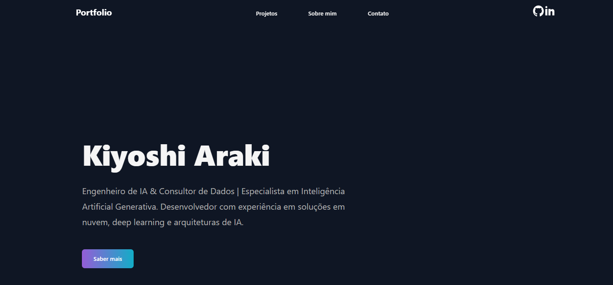
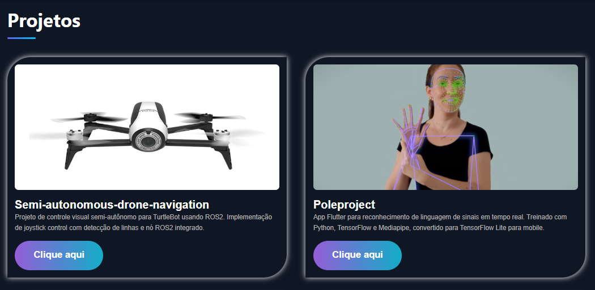
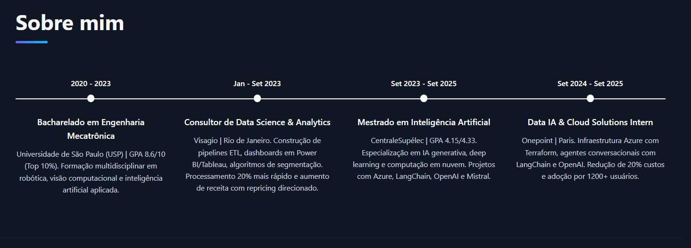
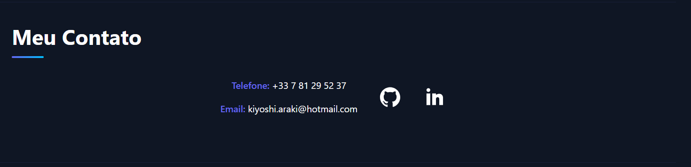

# **Portfolio — Kiyoshi Araki**

Um portfólio profissional moderno desenvolvido em **React**, **TypeScript** e **Vite**, apresentando a trajetória, projetos e competências técnicas de **Kiyoshi Araki**, Engenheiro de IA e Consultor de Dados.

---

##  **Estrutura e Seções**

###  Navegação e Hero Section

O header fixo na parte superior oferece acesso rápido às principais seções do portfólio por meio de links navegáveis.



---

###  Projetos

A galeria de projetos exibe seis trabalhos destacados em um layout de grid responsivo.
Cada projeto apresenta uma imagem, título, descrição e link direto para o repositório no GitHub.

**Destaques:**

* **Semi-autonomous-drone-navigation**
  Controle visual semi-autônomo para TurtleBot usando ROS2

* **Poleproject**
  Aplicativo Flutter para reconhecimento de linguagem de sinais em tempo real

Os cards de projeto possuem efeitos de *hover* que aumentam a profundidade visual durante a interação.



---

### 👨‍💻 Sobre Mim

A seção **Experience** apresenta uma timeline interativa dos marcos profissionais e acadêmicos, organizada cronologicamente.



---

### 📬 Contato

A seção final oferece informações de contato e links para plataformas profissionais:

* Links interativos para GitHub e LinkedIn
* Ícones com efeitos visuais ao passar o mouse



---

## 🛠 **Stack Tecnológico**

O projeto foi desenvolvido utilizando:

* **React 19.2.0** — Framework para construção da interface
* **TypeScript 5.9** — Tipagem estática para maior segurança
* **Vite 7.2.4** — Build tool moderna e rápida
* **CSS3** — Estilização com variáveis CSS customizadas
* **ESLint** — Linting e verificação de código

---

## 🎨 **Características Visuais**

A interface utiliza um tema escuro moderno com:

* Paleta de cores baseada em azuis e roxos
* Gradientes lineares em botões e elementos interativos
* Animações CSS suaves
* Sombras e bordas arredondadas para profundidade
* Alto contraste para melhor acessibilidade

---

## 📁 **Estrutura do Projeto**

```txt
src/
├── components/
│   ├── Header.tsx        # Navegação e header fixo
│   ├── Hero.tsx          # Seção de apresentação
│   ├── Projects.tsx      # Galeria de projetos
│   ├── Experience.tsx    # Timeline profissional
│   ├── Skills.tsx        # Habilidades com filtros
│   ├── Contact.tsx       # Informações de contato
│   ├── Footer.tsx        # Rodapé
│   └── *.css             # Estilos dos componentes
│
├── assets/               # Imagens e ícones
├── App.tsx               # Componente principal
├── App.css               # Estilos globais
├── main.tsx              # Ponto de entrada
└── index.css             # Reset e estilos base
```

---

## 🔗 **Links e Redes**

* **LinkedIn:** [https://www.linkedin.com/in/kiyoshi-araki/](https://www.linkedin.com/in/kiyoshi-araki/)
* **GitHub:** [https://github.com/kiyoshi2000](https://github.com/kiyoshi2000)
* **Email:** [kiyoshi.araki@hotmail.com](mailto:kiyoshi.araki@hotmail.com)

---

## ⚙️ **Funcionalidades Implementadas**

* Navegação suave entre seções (*smooth scroll*)
* Menu responsivo para dispositivos móveis
* Filtro dinâmico de habilidades
* Timeline interativa
* Links diretos para projetos
* Animações de entrada e transições CSS
* Interface otimizada para **dark mode**
